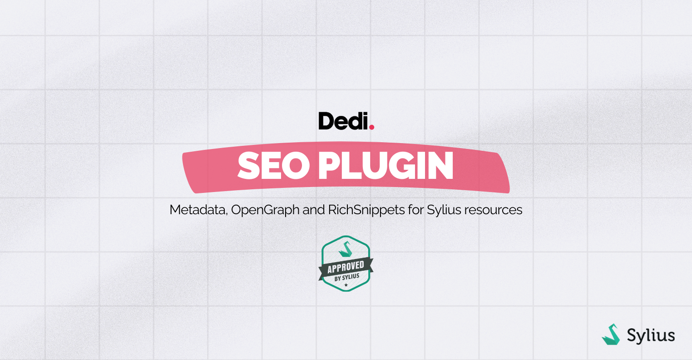

<h1 align="center">Sylius Plugin SEO by Dedi</h1>

Sylius SEO plugin by Dedi. Metadata, OpenGraph and RichSnippets (Breadcrumb and Product) for all Sylius resources
.

Dedi - web agency specialized in eCommerce since 2004
UX, UI, Dev, SEO, SEA

## Overview

This Plugin provides an almost plug and play solution for your SEO needs. It integrates Metadata, OpenGraph and RichSnippets (Breadcrumb and Product) on all shop pages.

It provides integration for Google Analytics and Google Tag Manager through your channel configuration. 

## Documentation

- [Installation](doc/INSTALL.md)
- [Features](doc/FEATURES.md)
- [Contribute](doc/CONTRIBUTE.md)
