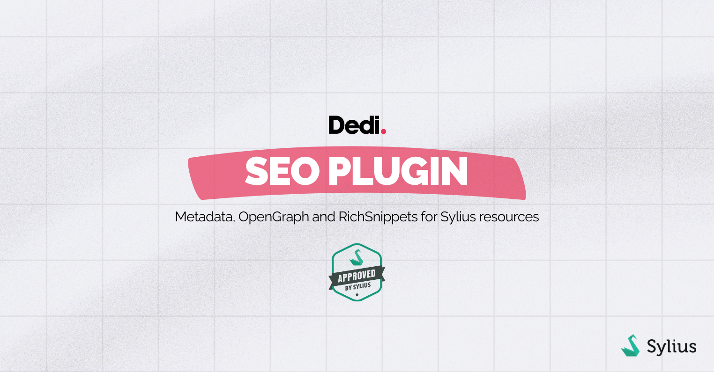
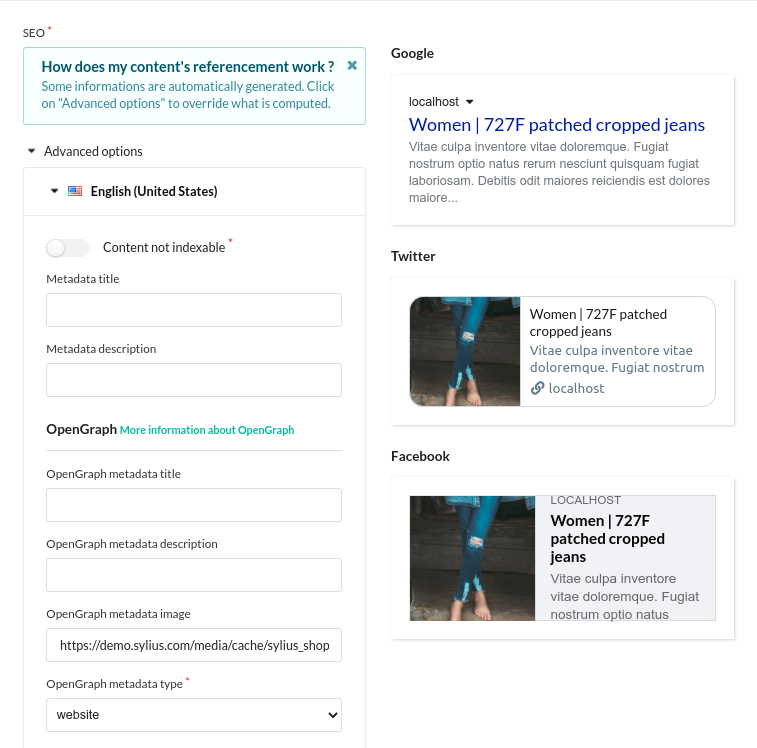

<h1 align="center">Sylius Plugin SEO by Dedi</h1>

Sylius SEO plugin by Dedi. Metadata, OpenGraph, noindex rules and RichSnippets (Breadcrumb and Product) for your Sylius shop.

Dedi - web agency specialized in eCommerce since 2004
UX, UI, Dev, SEO, SEA

## Overview

This Plugin provides an almost plug and play solution for your SEO needs:

- Metadata and OpenGraph for channels, products, taxons and any shop URL, with a Google / Twitter / Facebook preview in the admin
- **Marketing > SEO** admin page listing all SEO contents
- Per-locale indexability and noindex rules on routes (e.g. paginated or sorted taxon pages)
- Canonical and hreflang links
- Breadcrumb and Product RichSnippets (JSON-LD), with GTIN / MPN / SKU per product or per variant
- Google Analytics and Google Tag Manager through your channel configuration
- API Platform endpoints for SEO contents

| Plugin | Sylius | PHP |
|---|---|---|
| 4.x | 2.0 to 2.3 | 8.2+ |
| 3.x | 1.11 to 1.14 | 8.0+ |

## Documentation

- [Installation](doc/INSTALL.md)
- [Upgrade to 4.0](doc/UPGRADE-4.0.md)
- [Features](doc/FEATURES.md)
- [Default values](doc/DEFAULT_VALUES.md)
- [SEO for custom entities](doc/SEO_CUSTOM.md)
- [Custom rich snippets](doc/RICH_SNIPPETS.md)
- [Contribute](doc/CONTRIBUTE.md)
- [Troubleshooting](doc/TROUBLESHOOTING.md)
