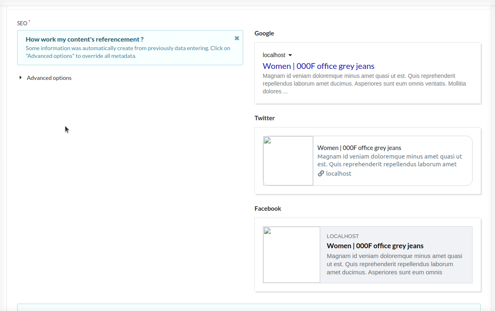
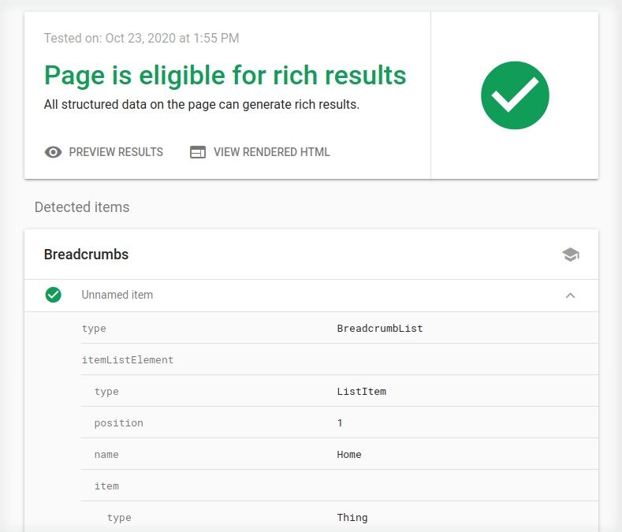
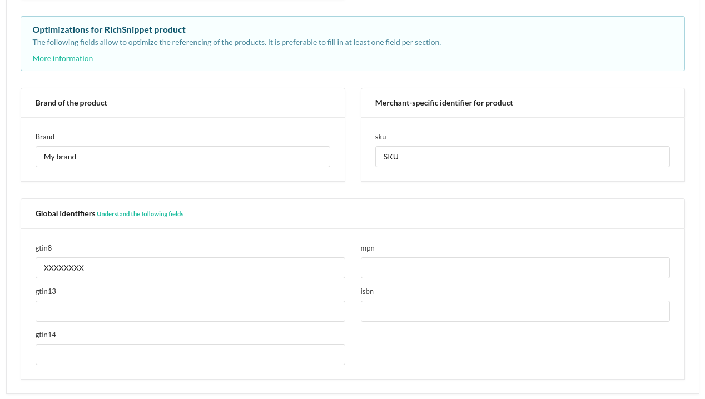
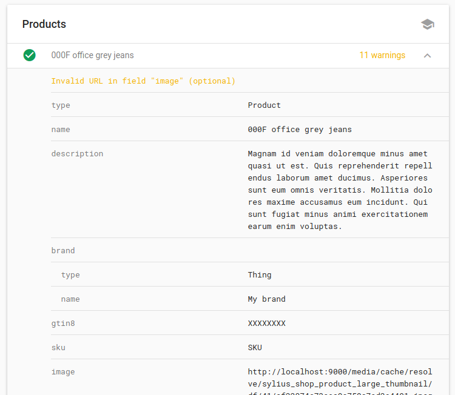
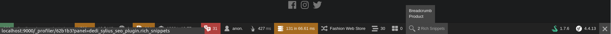
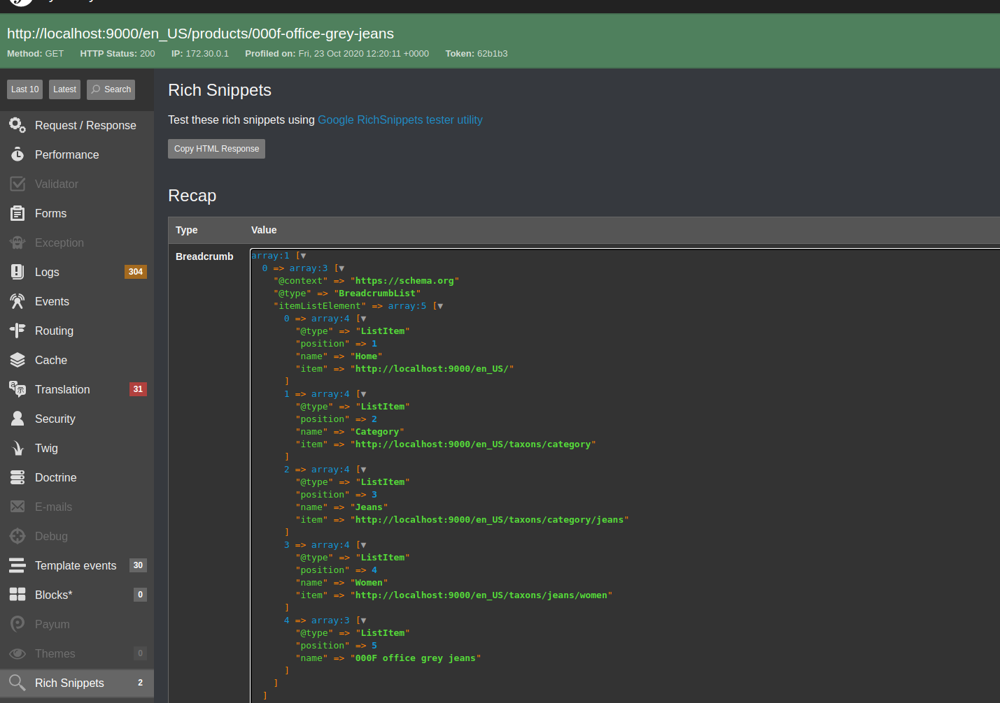

# Features

- [Features](#features)
  * [Metadata & OpenGraph](#metadata---opengraph)
    + [Definition](#definition)
    + [Usage & Result](#usage---result)
  * [RichSnippets](#richsnippets)
    + [Breadcrumb](#breadcrumb)
      - [Definition](#definition-1)
      - [Usage](#usage)
      - [Result](#result)
    + [Product](#product)
      - [Definition](#definition-2)
      - [Usage](#usage-1)
      - [Result](#result-1)
    + [Debug](#debug)

## Metadata & OpenGraph

### Definition

This plugin implements OpenGraph for great social (Google / Twitter / Facebook) integration.

### Usage & Result

Metadata & OpenGraph can be configured for the whole website through the Channel administration form and for each product through the product administration form. 

A dynamic preview for Google / Twitter and Facebook is also available.

## RichSnippets

This plugin implements the Breadcrumb and Product RichSnippets.

### Breadcrumb

#### Definition

This Rich Snippet allows your page to have its breadcrumb displayed through Google Search results.

By default, this plugin integrates the Rich Snippet "Breadcrumb" on the following shop pages :
* Homepage
* Taxon
* Product
* Contact

#### Usage

The Breadcrumb being automatically computed by the plugin, no configuration is needed in Sylius Administration.

#### Result

Result for a product on Google Rich Results Test:

For a more detailed example, here is the result of a [test of a product](https://search.google.com/test/rich-results?utm_campaign=sdtt&utm_medium=code&id=KbrOf3TZ8L9HmBuQW4-itQ) on Google Rich Result Test.

For more information regarding this Rich Snippet, please read [Google documentation](https://developers.google.com/search/docs/data-types/breadcrumb).

### Product

#### Definition

Product pages of your shop will be displayed in the following way on Google Search result.

#### Usage

This Rich Snippet product is computed using the product data (reviews, images, variants, ...). Additional information can be filled within the administration product form through the seo tab. 

#### Result

For a more detailed example, here is the result of a [test of a product](https://search.google.com/test/rich-results?utm_campaign=sdtt&utm_medium=code&id=KbrOf3TZ8L9HmBuQW4-itQ) on Google Rich Result Test. 

For more information regarding this Rich Snippet, please read [Google documentation](https://developers.google.com/search/docs/data-types/product).

### Debug

For your debugging needs, this plugin integrates in the Symfony Profiler.

