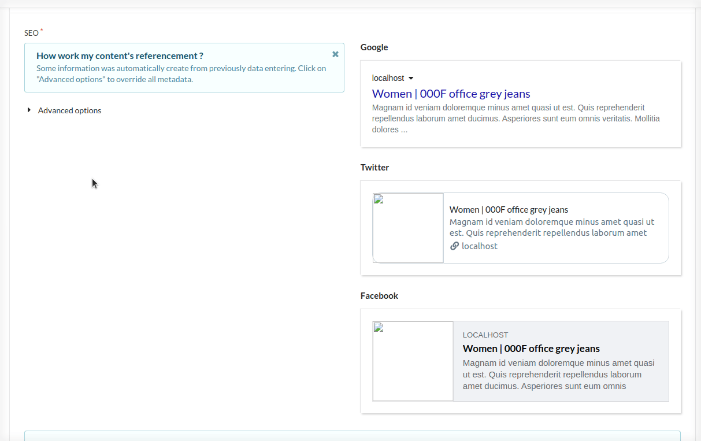
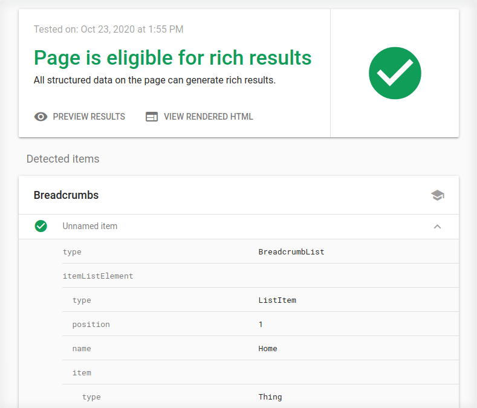
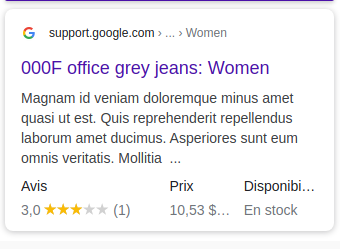
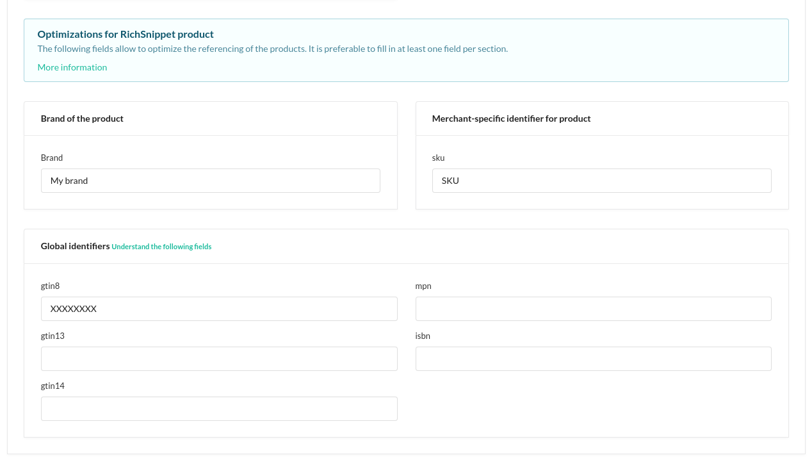
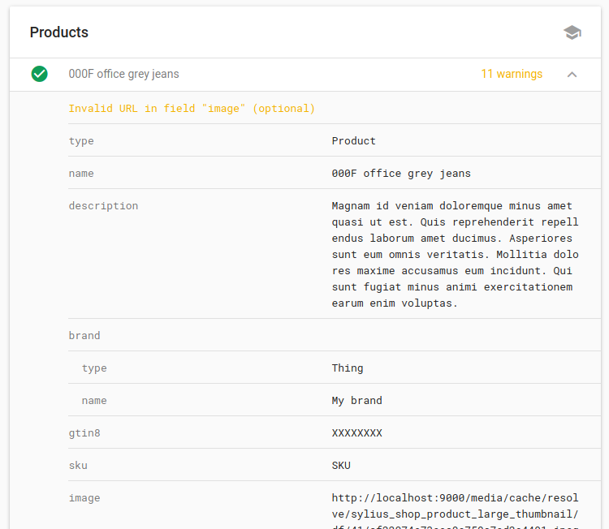
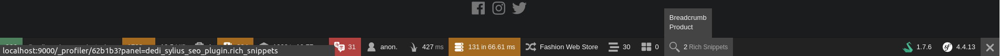
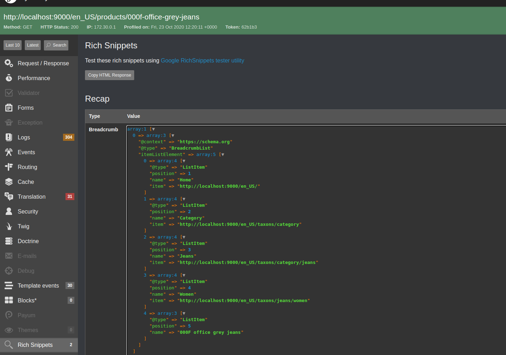

# Features

- [Metadata & OpenGraph](#metadata--opengraph)
  * [Where SEO content is edited](#where-seo-content-is-edited)
  * [How the page metadata is resolved](#how-the-page-metadata-is-resolved)
  * [Shop output](#shop-output)
- [SEO admin page](#seo-admin-page)
- [Indexability (noindex / nofollow)](#indexability-noindex--nofollow)
  * [Per SEO content](#per-seo-content)
  * [Noindex filters on routes](#noindex-filters-on-routes)
- [Canonical and alternate links](#canonical-and-alternate-links)
- [Google Analytics & Google Tag Manager](#google-analytics--google-tag-manager)
- [RichSnippets](#richsnippets)
  * [Breadcrumb](#breadcrumb)
  * [Product](#product)
  * [Debug](#debug)
- [API](#api)

## Metadata & OpenGraph

The plugin renders the page title, the meta description, the robots meta and OpenGraph tags (title, description, image, type, url) on every shop page.

### Where SEO content is edited

| Resource | Admin form | Requirement |
|---|---|---|
| Channel | Channel form, SEO section | `Channel` implements `ReferenceableInterface` |
| Product | Product form, SEO tab | `Product` implements `ReferenceableInterface` |
| Taxon | Taxon form, SEO section | `Taxon` implements `ReferenceableInterface` |
| Any shop URL | **Marketing > SEO** admin page, type `uri` | none |

See [installation](INSTALL.md#seo-usage-for-entities) for the entity setup.

Each SEO content holds, per locale: metadata title, metadata description, OpenGraph title, description and image, and indexability. The OpenGraph type is shared by all locales.

A dynamic preview for Google, Twitter and Facebook is displayed next to the form.



Empty fields can fall back to computed values (e.g. the product name as title). See [default values](DEFAULT_VALUES.md).

### How the page metadata is resolved

Metadata comes from a chain of metadata contexts, tagged `dedi_sylius_seo_plugin.context.metadata`. Each context that applies to the current request returns metadata. The results are merged field by field: for each field, the first non-empty value in priority order is used.

| Priority | Context | Applies when |
|---|---|---|
| 100 | `UriMetadataContext` | an SEO content of type `uri` matches the current URL and locale |
| 50 | `RequestParametersMetadataContext` | the route has a [noindex filter](#noindex-filters-on-routes) |
| 0 | `ProductMetadataContext` | the current page is a product page |
| 0 | `TaxonMetadataContext` | the current page is a taxon page |
| -50 | `ChannelMetadataContext` | always, when the channel implements `ReferenceableInterface` (site-wide fallback) |

For example, a product page with only a metadata title gets its description and OpenGraph image from the channel.

To support a custom page, implement `Dedi\SyliusSEOPlugin\SEO\Context\MetadataContextInterface`, throw `ContextNotAvailableInRequestException` when it does not apply, and tag the service with a priority. See [SEO for custom entities](SEO_CUSTOM.md).

### Shop output

The plugin registers these Twig hooks in the shop layout:

| Hook | Renders |
|---|---|
| `sylius_shop.base#metatags` | robots, description and OpenGraph meta tags, rich snippets (JSON-LD) |
| `sylius_shop.base.head` | canonical and alternate links, Google Analytics / Tag Manager script |
| `sylius_shop.base.before_body` | Google Tag Manager `<noscript>` iframe |

The page `<title>` is rendered by the `dedi_sylius_seo_get_title('Default title')` Twig function, which must be called in your layout (see [installation](INSTALL.md#override-default-layout-template)).

Available Twig functions:

| Function | Returns |
|---|---|
| `dedi_sylius_seo_get_title(?string $default)` | the resolved page title, or `$default` |
| `dedi_sylius_seo_get_metadata()` | the resolved `Metadata` object (`indexable`, `title`, `description`, `ogTitle`, `ogDescription`, `ogUrl`, `ogType`, `ogImage`) |
| `dedi_sylius_seo_get_rich_snippets()` | the rich snippets of the current page |
| `dedi_sylius_seo_get_image_url(string $path)` | the absolute URL of an uploaded image |

## SEO admin page

**Marketing > SEO** lists every SEO content (channel, product, taxon and URL). The grid can be searched, and filtered by product, taxon, URL, channel and indexability.

From this page you can create SEO contents of type `product`, `taxon` or `uri`. The `uri` type sets metadata for any shop URL (a CMS page, a filtered listing, ...). The URL is entered per locale and must be the full URL of the page (e.g. `https://example.com/en_US/taxons/t-shirts`). It has the highest priority, so it overrides the product, taxon and channel values on that page.

SEO contents of type `product` must be linked to a product, and those of type `taxon` to a taxon.

## Indexability (noindex / nofollow)

When a page is not indexable, the plugin renders:

```html
<meta name="robots" content="noindex, nofollow">
```

### Per SEO content

Each SEO content has a "not indexable" flag per locale. It can be set for a locale that has no translation. A locale without a value uses the value of the fallback locale, and defaults to indexable.

### Noindex filters on routes

Noindex filters mark pages as not indexable based on the request (query parameters, route, ...). They are attached to a route with the `_seo.no_index_no_follow_filter` option.

The plugin ships the `dedi_sylius_seo_plugin.links.shop.taxon_no_index_no_follow_filter` filter, which marks taxon pages as not indexable when they are paginated (`page` > 1) or sorted. To enable it, redefine the Sylius taxon route:

```yaml
# config/routes/sylius_shop.yaml
sylius_shop_product_index:
    path: /{_locale}/taxons/{slug}
    methods: [GET]
    requirements:
        _locale: ^[a-z]{2}(?:_[A-Z]{2})?$
        slug: .+
    defaults:
        _controller: sylius.controller.product::indexAction
        _sylius:
            template: "@SyliusShop/product/index.html.twig"
            grid: sylius_shop_product
        _seo:
            no_index_no_follow_filter: dedi_sylius_seo_plugin.links.shop.taxon_no_index_no_follow_filter
```

To create your own filter, implement `Dedi\SyliusSEOPlugin\Filter\FilterInterface` (or compose the provided ones with `AndSpecification` / `OrSpecification`) and tag the service `dedi_sylius_seo_plugin.links.shop.no_index_no_follow_filter`. The service id is the value to use in `_seo.no_index_no_follow_filter`.

Provided specifications (`Dedi\SyliusSEOPlugin\Filter\Specification`):

| Specification | Satisfied when |
|---|---|
| `IsHomePageFilter` | the route is the shop homepage |
| `IsContactPageFilter` | the route is the contact page |
| `IsProductFilter` | the route is a product page |
| `IsTaxonFilter` | the route is a taxon page |
| `IsCartFilter` | the route is the cart summary |
| `IsLoginFilter` | the route is the login, register or password reset page |
| `IsPaginatedFilter` | the `page` query parameter is greater than 1 |
| `IsSortedFilter` | the request has a `sorting` query parameter |

## Canonical and alternate links

Every shop page gets:

- a `<link rel="canonical">` pointing to the current route, without query parameters,
- one `<link rel="alternate" hreflang="...">` per other locale of the channel, pointing to the homepage in that locale (e.g. `hreflang="fr-fr"`).

## Google Analytics & Google Tag Manager

When the `Channel` implements `SeoAwareChannelInterface` (see [installation](INSTALL.md#add-google-analytics-and-google-tag-manager-configuration)), the channel form has a Google Analytics code and a Google Tag Manager id. The plugin then adds the matching script to the shop pages of that channel, and the `<noscript>` iframe for Google Tag Manager.

If both are filled, only Google Tag Manager is used.

## RichSnippets

This plugin implements the Breadcrumb and Product RichSnippets, rendered as JSON-LD. To add your own, see [Rich Snippets](RICH_SNIPPETS.md).

### Breadcrumb

This Rich Snippet allows your page to have its breadcrumb displayed through Google Search results.


It is added to the following shop pages:
* Homepage
* Taxon
* Product
* Contact

The breadcrumb is computed from the parents of the page: the product main taxon, then the taxon parents, up to the homepage. No configuration is needed in the administration.

Result for a product on Google Rich Results Test:



For more information regarding this Rich Snippet, please read [Google documentation](https://developers.google.com/search/docs/appearance/structured-data/breadcrumb).

### Product

Product pages of your shop will be displayed in the following way on Google Search result.



The rich snippet depends on the number of enabled variants:

- **one enabled variant**: a `Product`, with a single `Offer`,
- **several enabled variants**: a `ProductGroup`, with one `Product` per variant in `hasVariant`, as [recommended by Google](https://developers.google.com/search/docs/appearance/structured-data/product-variants).

#### Product (one enabled variant)

| Field | Source |
|---|---|
| `name`, `description` | product name and short description |
| `brand` | product SEO tab |
| `gtin8`, `gtin13`, `gtin14`, `mpn`, `sku` | variant SEO tab, or product SEO tab when empty on the variant |
| `isbn` | product SEO tab (the type becomes `["Product", "Book"]`, as `isbn` is only valid on `Book`) |
| `image` | product images |
| `offers` | price for the current channel and currency, availability from stock, product url |
| `review`, `aggregateRating` | accepted reviews: best rated review and average rating |

#### ProductGroup (several enabled variants)

| Field | Source |
|---|---|
| `name`, `description`, `url` | product name, short description and url |
| `brand` | product SEO tab |
| `productGroupID` | product SKU from the SEO tab, or product code |
| `image` | product images |
| `variesBy` | options mapped to a Google-supported property (see below) |
| `hasVariant` | one `Product` per enabled variant (see below) |
| `review`, `aggregateRating` | accepted reviews: best rated review and average rating |

Each variant `Product` has:

| Field | Source |
|---|---|
| `name` | product name, followed by the variant name or its option values (e.g. `T-Shirt - XL`) |
| `image` | variant images, or product images when the variant has none |
| `gtin8`, `gtin13`, `gtin14`, `mpn`, `sku` | variant SEO tab |
| `size`, `color`, ... | option values mapped to a Google-supported property |
| `offers` | price for the current channel and currency, availability from stock, product url |

Product-level `gtin*`, `mpn` and `isbn` are not used in a `ProductGroup`, as they cannot identify several variants. Fill them per variant.

The Sylius shop shows all variants on the product page, so every variant offer uses the product url (Google's "single-page" setup).

Example:

```json
{
    "@context": "https://schema.org",
    "@type": "ProductGroup",
    "name": "T-Shirt",
    "url": "https://example.com/en_US/products/t-shirt",
    "brand": { "@type": "Brand", "name": "Dedi" },
    "productGroupID": "T_SHIRT",
    "variesBy": ["https://schema.org/size"],
    "hasVariant": [
        {
            "@type": "Product",
            "name": "T-Shirt - S",
            "gtin13": "4006381333931",
            "sku": "TSHIRT-S",
            "size": "S",
            "offers": {
                "@type": "Offer",
                "url": "https://example.com/en_US/products/t-shirt",
                "priceCurrency": "USD",
                "price": "60.58",
                "availability": "https://schema.org/InStock"
            }
        }
    ]
}
```

#### Configuration

The product identifiers are filled in the product form, in the SEO tab:



Variant identifiers require your `ProductVariant` to implement `RichSnippetProductVariantSubjectInterface` (see [installation](INSTALL.md#product-variant-identifiers-optional)). The variant form then gets a SEO tab with `sku`, `gtin8`, `gtin13`, `gtin14` and `mpn`.

To fill `variesBy` and the variant properties, map your Sylius product option codes to the properties supported by Google (`color`, `size`, `material`, `pattern`, `suggestedAge`, `suggestedGender`):

```yaml
# config/packages/dedi_sylius_seo_plugin.yaml
parameters:
    dedi_sylius_seo_plugin.rich_snippets.product.varies_by:
        t_shirt_size: size
        t_shirt_color: color
```

Options that are not mapped, or mapped to another property, are only used in the variant name.

#### Result



For more information regarding this Rich Snippet, please read [Google documentation](https://developers.google.com/search/docs/appearance/structured-data/product).

### Debug

For your debugging needs, this plugin integrates in the Symfony Profiler.





## API

SEO contents are exposed through API Platform.

| Method | Path | Description |
|---|---|---|
| `GET` | `/api/v2/shop/seo-contents` | list, filterable by `uri`, product code, taxon code and channel code |
| `GET` | `/api/v2/shop/seo-contents/{id}` | one SEO content |
| `GET` | `/api/v2/shop/seo-contents-for-product/{id}` | resolved metadata of a product (by id) |
| `GET` | `/api/v2/shop/seo-contents-for-taxon/{id}` | resolved metadata of a taxon (by id) |
| `GET`, `POST` | `/api/v2/admin/seo-contents` | list and create |
| `GET`, `PUT`, `DELETE` | `/api/v2/admin/seo-contents/{id}` | read, update and delete |

The `seo-contents-for-product` and `seo-contents-for-taxon` endpoints merge the product (or taxon) and channel metadata, like the shop does. Pass the page URL in the `uri` query parameter to also apply a matching SEO content of type `uri`.
