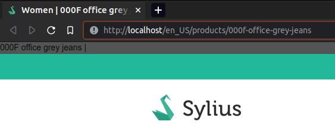

# Troubleshooting

## The title is shown in the header


Sylius's defaut `<title>` implementation might cause issues, with the title being rendered twice.

As the plugin uses an event, we are forced to display the `<title>` tag within the event (to avoid the Debug comment to be printed in the title)

The following code from Sylius conflicts with the event `dedi_sylius_seo_plugin.title`

```twig

    {{ product.name }} | {{ parent() }}

```

This code will result in the product's name to be printed and then the event `dedi_sylius_seo_plugin.title` been executed, which will load the `<title` HTML tag

```html
000F office grey jeans | <!-- BEGIN EVENT | event name: "dedi_sylius_seo_plugin.title" -->
<!-- BEGIN BLOCK | event name: "dedi_sylius_seo_plugin.title", block name: "dedi_seo_title", template: "@DediSyliusSEOPlugin/Shop/Header/_title.html.twig", priority: 0 -->
    <title>Women | 000F office grey jeans</title>
<!-- END BLOCK | event name: "dedi_sylius_seo_plugin.title", block name: "dedi_seo_title" -->
<!-- END EVENT | event name: "dedi_sylius_seo_plugin.title" -->
```

The workaround for this is to override any template from Sylius that implements the block `title` like the exemple shown below

```twig



    {{ sylius_template_event('dedi_sylius_seo_plugin.title', { resource: product ?? sylius.channel }) }}

```
